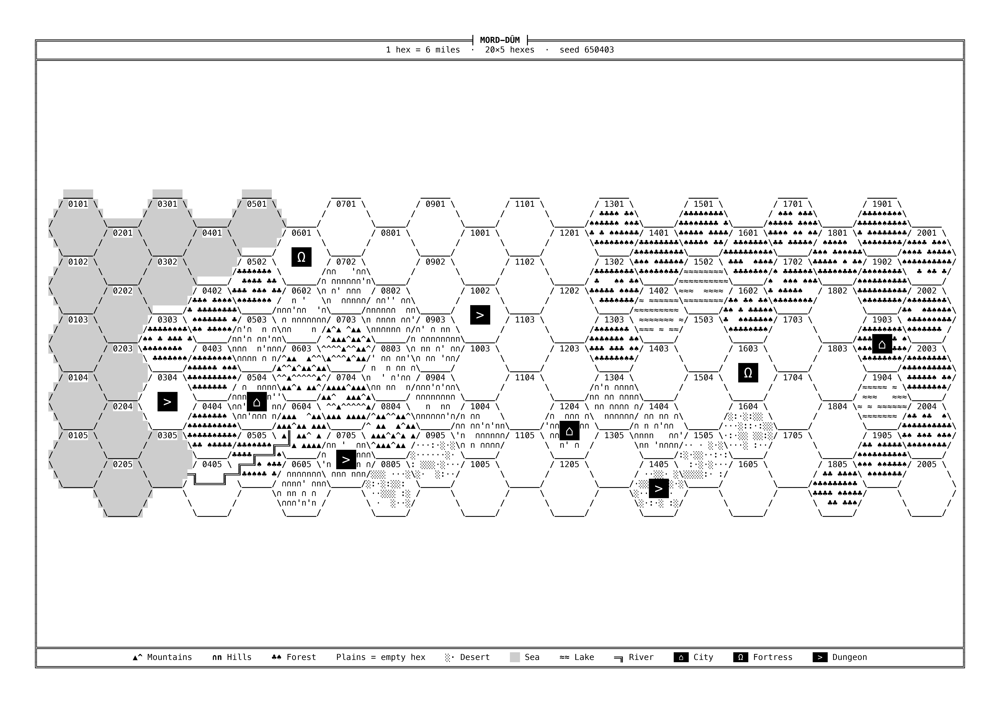

# WyrmHex

**Italiano** · [English](README.md)

```
 _       __                     __  __
| |     / /_  ___________ ___  / / / /__  _  __
| | /| / / / / / ___/ __ `__ \/ /_/ / _ \| |/_/
| |/ |/ / /_/ / /  / / / / / / __  /  __/>  <
|__/|__/\__, /_/  /_/ /_/ /_/_/ /_/\___/_/|_|
       /____/

                    v0.0.2
                                                                          /\
                                                                         /¨¨\
               ______________                /\    *                    /¨¨¨¨\
           _.-'            ,.`:===,         /__\   |                   / ¨ ¨ ¨\
       _.-'         __.---'.:'              (..)---+                  /        \        /\
     .'         .--'     .:'               /|##|   |                 /.  .      \      /¨¨\
   .'         .'        ./                _.|__|.__|_               /   .        \    /¨ ¨ \
,.'-,____   .'         ./    ,),,)        |_|_|_|_|_|              /      .       \  /      \
         `.'___.--,   ./   \'     `,)      |       |              /   |>     |>    \/.       \
         '         `;./   ,'  .--,  `,  ,  |  []   |             /   [_]_n_n[_]     \
                    ;/    :  /    } ,C}'   |       |            / .  | |'  '| |      \
                    \\    \  \    `,,V     |    [] |           /     |_|_/\_|_|       \
    ,      .---,    .\\-, `,  \    ;;l     |       |          /                  .     \
    \`,   /  _  \  /  _  \ `,  \   `;/     |  []   |         /    | σ                   \
     \ `.'  / \  `'  / \  `'   /           |   _   |        /     ´√))θ                 .\  .
      `,__.'   `,__.'   `,___.'           _|__/ \__|_      /       / \      .             \
 ,     .     ,,     .      ,      .    ,     .     ,,     .      ,      .     ,,     .      ,
"""

```

**WyrmHex** è un piccolo programma che disegna a caso una mappa a esagoni per campagne di gioco di ruolo old school (OSR). La mappa è fatta solo di lettere e simboli, come nei vecchi videogiochi Dwarf Fortress e Moonring:

- **foreste** `♣♠`, **montagne** `▲^`, **colline** `∩n`, **deserti** `░·`, **laghi** `≈`;
- la **pianura** resta vuota e il **mare** è una campitura grigia;
- i **fiumi** sono doppie linee `═║╔╗`;
- **città**, **fortezze** e **dungeon** sono riquadri neri con un simbolo bianco.

La mappa esce in nero su sfondo bianco, pronta da stampare su un foglio **A4, A3 o A2** a 600 dpi: il programma ti consiglia il formato più adatto al numero di esagoni e gira il foglio in verticale o in orizzontale da solo, secondo la forma della mappa. Ogni volta ottieni due immagini della stessa mappa: una **senza numeri** (da mostrare ai giocatori) e una **con il numero in ogni esagono** (per il master).

---

## 1. Cosa ti serve

Metti questi file nella **stessa cartella**, per esempio una cartella `mappe` sul Desktop:

- `wyrmhex.py` (il programma)
- `requirements.txt`
- `README.it.md` (questa guida) e `README.md` (la stessa guida in inglese)

Non serve creare altro: la cartella `maps_generated`, dove finiscono le mappe, la crea il programma la prima volta che lo usi.

Ti serve anche **Python 3.14**, il programma che fa funzionare i file `.py`. Vanno bene anche versioni un po' più vecchie, dalla 3.11 in su.

---

## 2. Installazione (si fa una volta sola)

### Passo 1 — Installa Python

- **Windows e macOS:** vai su <https://www.python.org/downloads/>, scarica Python 3.14 e installalo come un normale programma.
  - Su Windows, se durante l'installazione compare la casella **"Add python.exe to PATH"**, spuntala.
- **Linux:** Python di solito è già installato. Se la tua distribuzione non ha la 3.14, va bene anche la versione che hai, purché sia la 3.11 o successiva.

### Passo 2 — Apri il terminale nella cartella dei file

Il terminale è una finestra in cui si scrivono comandi.

- **Windows 11:** apri la cartella `mappe`, fai clic destro in uno spazio vuoto e scegli **"Apri nel Terminale"**.
- **Windows 10:** apri la cartella `mappe`, fai clic sulla barra dell'indirizzo in alto, scrivi `cmd` e premi Invio.
- **macOS:** apri l'app **Terminale** (in Applicazioni → Utility). Scrivi `cd` seguito da uno spazio, trascina la cartella `mappe` dentro la finestra e premi Invio.
- **Linux:** apri la cartella, fai clic destro in uno spazio vuoto e scegli **"Apri nel terminale"**.

### Passo 3 — Prepara il programma

Copia i comandi qui sotto **uno alla volta** e premi Invio dopo ciascuno. Il primo crea, dentro la cartella, uno spazio riservato al programma: una sottocartella nascosta `.venv`, che non devi toccare. Il secondo scarica **Pillow**, la libreria che serve a creare le immagini.

**Windows**
```
py -m venv .venv
.venv\Scripts\python -m pip install -r requirements.txt
```

**macOS e Linux**
```
python3 -m venv .venv
.venv/bin/python -m pip install -r requirements.txt
```

Se alla fine compare una riga che inizia con `Successfully installed`, è tutto pronto.

---

## 3. Creare una mappa

Apri il terminale nella cartella, come al passo 2, e scrivi:

**Windows**
```
.venv\Scripts\python wyrmhex.py
```

**macOS e Linux**
```
.venv/bin/python wyrmhex.py
```

Per prima cosa il programma ti chiede la **lingua**: scrivi `1` per l'italiano o `2` per l'inglese (con Invio resta l'italiano). Da lì in poi domande, messaggi e anche i testi stampati sulla mappa (legenda, scala, titolo di partenza) sono nella lingua scelta.

Poi compare la schermata di benvenuto, con il titolo e un disegno: premi **INVIO** per cominciare. Il programma ti fa alcune domande. **Ogni domanda ha una risposta già pronta tra parentesi quadre: se ti va bene, premi solo Invio.**

1. **Cosa vuoi fare?** Scrivi `1` per una mappa nuova, `2` per rifare una mappa già fatta (vedi il capitolo 4).
2. **Esagoni in base e in altezza:** quante colonne e quante righe di esagoni vuoi. La risposta pronta è `auto`: il programma sceglie da solo quanti esagoni riempiono un foglio A4 restando leggibili (33 × 15).
3. **Numero di dungeon, città e fortezze** da mettere sulla mappa.
4. **Percentuali di terreno:** quanta parte della mappa è pianura, mare, laghi, colline, montagne, foreste e deserti. La somma non può superare 100; se resta qualcosa, diventa pianura. Se sbagli, il programma te lo dice e ti fa reinserire i numeri.
5. **Numero di fiumi:** con `-1` il programma decide da solo.
6. **Titolo** stampato in cima alla mappa.
7. Se usare **solo i caratteri base della tastiera** (senza simboli come ♣ ▲ ≈). Di solito rispondi no: basta premere Invio.

Finite le domande compare un mago con la scritta **"L'incantesimo di evocazione ha inizio!"** (in inglese: *"The conjuring spell begins!"*): da qui il programma si mette al lavoro.

Mentre lavora, mostra i passaggi che sta facendo, ognuno con una **barra di avanzamento** che si riempie passo dopo passo:

```
[████░░░░░░░░]  4/12  Mare: allagamento dall'esagono di bordo più basso verso le quote minori
```

Durante il disegno delle due immagini, che è la parte più lunga, compare anche una seconda barra con la percentuale, che si aggiorna sul posto fino a `100%  fatto`. Quando la mappa è pronta ti chiede l'ultima cosa:

8. **Formato di stampa** delle due mappe: `A4`, `A3` o `A2`. Il programma valuta il formato in base al numero di esagoni: prima della domanda vedi, per ogni formato, quanto verranno grandi gli esagoni e i caratteri, e se saranno ben leggibili. La risposta pronta tra parentesi è il **formato consigliato**, cioè il più piccolo in cui la mappa si legge bene; più esagoni hai scelto, più grande sarà. **La scelta finale è tua:** premi Invio per il formato consigliato, oppure scrivine un altro. Esempio:

   ```
   · Griglia di 12 x 30 esagoni: ecco come verrebbe stampata su ogni formato (esagono misurato da lato piatto a lato piatto)
   · A4 verticale   esagoni piccoli da  8 mm, caratteri da 1.07 mm (troppo piccoli)
   · A3 verticale   esagoni piccoli da 12 mm, caratteri da 1.53 mm (ben leggibili)   <- consigliato
   · A2 verticale   esagoni grandi  da 18 mm, caratteri da 1.50 mm (ben leggibili)
     La scelta finale è tua: premi Invio per il formato consigliato, oppure scrivine un altro.
     Formato di stampa per le due mappe (A4, A3, A2) [A3]:
   ```

   Sui fogli grandi, se c'è spazio, il programma usa esagoni più grandi, così la mappa resta ben proporzionata.

Alla fine elenca dove sono le città, le fortezze e i dungeon, con il numero del loro esagono: comodo per gli appunti del master.

---

## 4. Rifare una mappa già fatta

Ogni mappa ha un **seme**: è il nome della sua cartella dentro `maps_generated` e il numero all'inizio del nome dei suoi file. Per esempio, il seme di `maps_generated/482913/482913_nonumber.png` è `482913`.

Per rifare esattamente quella mappa, avvia il programma, scegli la lingua, alla domanda "Cosa vuoi fare?" rispondi `2` e scrivi il seme. Ogni immagine conserva al suo interno le impostazioni con cui è stata creata, e il programma le rilegge da lì: per questo il file `<seme>_nonumber.png` deve essere ancora nella sua cartella `maps_generated/<seme>`. Le mappe fatte con le versioni precedenti, salvate direttamente nella cartella del programma, vengono trovate lo stesso. La mappa rifatta finisce nella cartella `maps_generated/<seme>` e sostituisce i file che c'erano. Ti chiede di nuovo solo se usare i caratteri base e, alla fine, il formato di stampa (la risposta pronta è il formato usato la volta prima): così puoi rifare la stessa mappa, per esempio, in A3 invece che in A4.

Se rifai la mappa in una lingua diversa da quella della prima volta, il titolo e la scala di partenza vengono tradotti (per esempio "Terre Selvagge" diventa "Wild Lands"); un titolo scelto da te resta com'è.

Se il file non c'è più, il programma ti chiede di reinserire a mano **le stesse impostazioni** usate la prima volta. Il seme da solo non basta: con impostazioni diverse esce una mappa diversa.

---

## 5. I file che ottieni

La prima volta che lo usi, il programma crea accanto a `wyrmhex.py` una cartella chiamata **`maps_generated`**. Ogni mappa ha lì dentro una cartella tutta sua, che ha per nome il seme della mappa, con dentro i suoi quattro file:

```
maps_generated/
  482913/
    482913_nonumber.png
    482913_nonumber.txt
    482913_number.png
    482913_number.txt
```

Alla fine il programma ti dice in quale cartella ha messo i file.

| File | Cos'è |
|---|---|
| `482913_nonumber.png` | La mappa senza numeri, per i giocatori |
| `482913_number.png` | La stessa mappa con il numero in ogni esagono, per il master |
| `482913_nonumber.txt`, `482913_number.txt` | La mappa come testo, apribile con il Blocco note |

I numeri degli esagoni hanno quattro cifre: le prime due indicano la colonna, le ultime due la riga. `0101` è l'esagono in alto a sinistra; `0305` è nella terza colonna, quinta riga.

---

## 6. Stampare

Le immagini hanno già la misura esatta del foglio che hai scelto (A4, A3 o A2), a 600 dpi: si stampano nitide anche sui fogli grandi.

- Stampa sul **formato che hai scelto**, in bianco e nero, con il foglio nello stesso verso dell'immagine (verticale o orizzontale).
- Nelle opzioni di stampa scegli **"Dimensioni effettive"** o **"100%"**. Evita "Adatta alla pagina", che rimpicciolisce la mappa.
- Se la tua stampante arriva solo all'A4, per A3 e A2 puoi rivolgerti a una copisteria: porta il file PNG così com'è.

---

## 7. Per chi vuole andare più veloce: le opzioni

Invece di rispondere alle domande, puoi scrivere tutto su una riga. Le impostazioni che non scrivi prendono il valore di partenza. Esempi (su Windows usa `.venv\Scripts\python` al posto di `.venv/bin/python`):

```
.venv/bin/python wyrmhex.py --griglia 30x15 --citta 4 --dungeon 6
.venv/bin/python wyrmhex.py --griglia 50x30 --formato A2
.venv/bin/python wyrmhex.py --mare 30 --pianura 15 --titolo "Isola dei Venti"
.venv/bin/python wyrmhex.py --riproduci 482913
.venv/bin/python wyrmhex.py --language en --grid 30x15 --cities 4
```

Ogni opzione ha anche un nome inglese (nella tabella dopo la barra `/`), e puoi mescolarli come vuoi. Senza `--lingua` i messaggi e i testi della mappa sono in italiano.

| Opzione | Cosa fa | Esempio |
|---|---|---|
| `--lingua` / `--language` | Lingua dei messaggi e dei testi della mappa: `it` o `en` | `--lingua en` |
| `--griglia` / `--grid` | Colonne x righe di esagoni (`auto` = riempie un A4) | `--griglia 20x15` |
| `--citta`, `--fortezze`, `--dungeon` / `--cities`, `--fortresses`, `--dungeons` | Quanti siti di ogni tipo | `--citta 4` |
| `--pianura`, `--mare`, `--laghi`, `--colline`, `--montagne`, `--foreste`, `--deserti` / `--plains`, `--sea`, `--lakes`, `--hills`, `--mountains`, `--forests`, `--deserts` | Percentuale di ogni terreno | `--mare 25` |
| `--fiumi` / `--rivers` | Numero di fiumi (`-1` = automatico) | `--fiumi 3` |
| `--titolo` / `--title` | Titolo in cima alla mappa | `--titolo "Terre del Nord"` |
| `--scala` / `--scale` | Testo della scala | `--scala "8 km"` |
| `--seme` / `--seed` | Usa un seme preciso invece di uno a caso | `--seme 42` |
| `--riproduci` / `--reproduce` | Rifà la mappa con quel seme, leggendo le impostazioni dal suo file (cercato in `maps_generated/<seme>`, o nella cartella di `--output`) | `--riproduci 482913` |
| `--formato` / `--format` | Formato di stampa: `A4`, `A3` o `A2`. Se manca, il programma te lo chiede alla fine, proponendo quello consigliato (o, con `--riproduci`, quello della volta prima) | `--formato A3` |
| `--orientamento` / `--orientation` | Di solito non serve: il verso del foglio segue la forma della mappa. Puoi forzarlo con `verticale` o `orizzontale` (`portrait` o `landscape`) | `--orientamento verticale` |
| `--output` | Cartella in cui salvare le mappe al posto di `maps_generated`; anche lì ogni mappa ha la sua cartella con il seme | `--output mappe` |
| `--solo-ascii` / `--ascii-only` | Usa solo lettere e segni semplici della tastiera | `--solo-ascii` |
| `--dimensione` / `--size` | Esagoni `piccola` o `grande` (`small` o `large`) | `--dimensione grande` |
| `--font` | Usa un file di carattere a tua scelta (deve avere tutte le lettere della stessa larghezza) | `--font consola.ttf` |

Per vedere l'elenco completo delle opzioni, aggiungi `--help` dopo il nome del file; per sapere quale versione hai, aggiungi `--version`.

---

## 8. Problemi comuni

**"py" / "python3" non è riconosciuto come comando.**
Python non è installato, oppure su Windows non è stato aggiunto al PATH. Reinstallalo spuntando "Add python.exe to PATH", poi chiudi e riapri il terminale.

**"Manca la libreria Pillow".**
Non hai fatto il passo 3, oppure stai avviando il programma con `py` o `python3` invece che con `.venv\Scripts\python` (Windows) o `.venv/bin/python` (macOS/Linux).

**Linux: `python3 -m venv .venv` dà un errore che parla di `ensurepip` o `venv`.**
Manca un pezzo di Python. Su Ubuntu e Debian installalo con `sudo apt install python3-venv`, poi ripeti il passo 3.

**"La somma delle percentuali di terreno è ...%, supera il 100%".**
Le percentuali che hai scritto, sommate, fanno più di 100. Abbassane qualcuna.

**"servono N esagoni di terra per i siti, ma la mappa ne ha solo M".**
Hai chiesto troppi siti per una mappa piccola o con troppa acqua. Riduci il numero di siti, ingrandisci la griglia o diminuisci mare e laghi.

**Il programma dice "Caratteri molto piccoli".**
La griglia è troppo grande per il formato scelto: la mappa si stampa, ma sarà difficile da leggere. Scegli un formato più grande (quello consigliato) oppure usa meno esagoni.

**Alcuni simboli sono diventati lettere semplici.**
Il carattere installato sul computer non ha quei simboli. Il programma li sostituisce da solo e te lo segnala. Puoi indicare un altro carattere con `--font`, per esempio `--font DejaVuSansMono.ttf`, se è installato.

**La mappa stampata è più piccola del foglio o spostata.**
Nelle opzioni di stampa scegli "Dimensioni effettive" o "100%", non "Adatta alla pagina".

**Non vedo la barra con la percentuale mentre disegna le immagini.**
Quella barra si aggiorna sulla stessa riga, e compare solo quando il programma gira in una finestra del terminale. Se lo avvii in altri modi (per esempio mandando i messaggi in un file) resta nascosta, ma la mappa viene creata lo stesso. La barra dei passaggi (`4/12`, `5/12`…) si vede sempre.

**Il disegno della schermata di benvenuto appare tagliato a destra.**
La finestra del terminale è troppo stretta: il disegno è largo 94 caratteri e il programma lo taglia per non scombinarlo. Allarga la finestra e riavvia il programma.

**Ho una mappa vecchia con lo sfondo nero.**
Le versioni precedenti permettevano lo sfondo nero; ora le mappe sono sempre su sfondo bianco. Rifai la mappa dal suo seme (capitolo 4) oppure usa `--riproduci` con il seme: torna uguale, con lo sfondo bianco.

## Esempi di output

### 12x10


### 20x5




### 80x80


