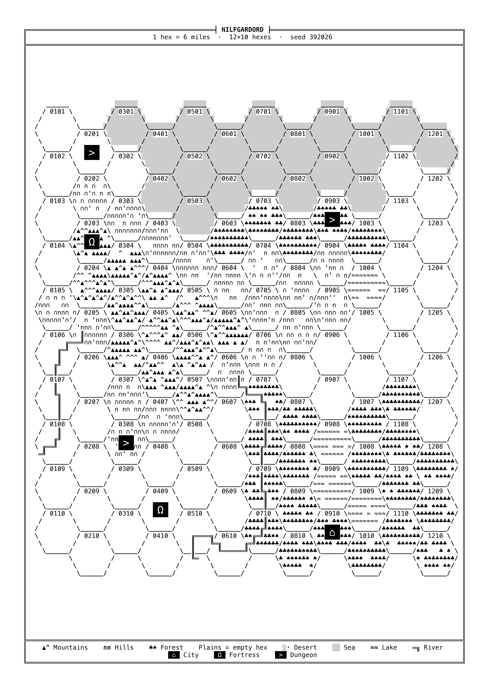

# WyrmHex

<div align="center">

**Italiano** · [English](README.md)

<br>
Compatibile con qualunque gioco di ruolo analogico "OSR".
</div>

```
 _       __                     __  __
| |     / /_  ___________ ___  / / / /__  _  __
| | /| / / / / / ___/ __ `__ \/ /_/ / _ \| |/_/
| |/ |/ / /_/ / /  / / / / / / __  /  __/>  <
|__/|__/\__, /_/  /_/ /_/ /_/_/ /_/\___/_/|_|
       /____/

                    v0.0.3
                                                                          /\
                                                                         /¨¨\
               ______________                /\    *                    /¨¨¨¨\
           _.-'            ,.`:===,         /__\   |                   / ¨ ¨ ¨\
       _.-'         __.---'.:'              (..)---+                  /        \        /\
     .'         .--'     .:'               /|##|   |                 /.  .      \      /¨¨\
   .'         .'        ./                _.|__|.__|_               /   .        \    /¨ ¨ \
,.'-,____   .'         ./    ,),,)        |_|_|_|_|_|              /      .       \  /      \
         `.'___.--,   ./   \'     `,)      |       |              /   |>     |>    \/.       \
         '         `;./   ,'  .--,  `,  ,  |  []   |             /   [_]_n_n[_]     \
                    ;/    :  /    } ,C}'   |       |            / .  | |'  '| |      \
                    \\    \  \    `,,V     |    [] |           /     |_|_/\_|_|       \
    ,      .---,    .\\-, `,  \    ;;l     |       |          /                  .     \
    \`,   /  _  \  /  _  \ `,  \   `;/     |  []   |         /    | σ                   \
     \ `.'  / \  `'  / \  `'   /           |   _   |        /     ´√))θ                 .\  .
      `,__.'   `,__.'   `,___.'           _|__/ \__|_      /       / \      .             \
 ,     .     ,,     .      ,      .    ,     .     ,,     .      ,      .     ,,     .      ,
"""

```

**WyrmHex** è un piccolo programma che disegna a caso una mappa a esagoni per campagne di gioco di ruolo old school (OSR). La mappa è fatta solo di lettere e simboli, come nei videogiochi Dwarf Fortress, ADOM, NetHack o Caves of Qud:

- **foreste** `♣♠`, **montagne** `▲^`, **colline** `∩n`, **deserti** `░·`, **laghi** `≈`, **paludi** `⌠"` (canne e ciuffi d'erba palustre, come in Dwarf Fortress);
- la **pianura** resta vuota e il **mare** è una campitura grigia;
- i **fiumi** sono doppie linee `═║╔╗`;
- **città**, **fortezze** e **dungeon** sono riquadri neri con un simbolo bianco.

La mappa esce in nero su sfondo bianco, pronta da stampare su un foglio **A4, A3 o A2** a 600 dpi: il programma ti consiglia il formato più adatto al numero di esagoni e gira il foglio in verticale o in orizzontale da solo, secondo la forma della mappa. Ogni volta ottieni due immagini della stessa mappa: una **senza numeri** (da mostrare ai giocatori) e una **con il numero in ogni esagono** (per il master).

---

## 1. Cosa ti serve

Metti questi file nella **stessa cartella**, per esempio una cartella `mappe` sul Desktop:

- `wyrmhex.py` (il programma)
- `requirements.txt`
- `README.it.md` (questa guida) e `README.md` (la stessa guida in inglese)

Non serve creare altro: la cartella `maps_generated`, dove finiscono le mappe, la crea il programma la prima volta che lo usi.

Ti serve anche **Python 3.14**, il programma che fa funzionare i file `.py`. Vanno bene anche versioni un po' più vecchie, dalla 3.11 in su.

---

## 2. Installazione

### Passo 1 — Installa Python

- **Windows e macOS:** vai su <https://www.python.org/downloads/>, scarica Python 3.14 e installalo come un normale programma.
  - Su Windows, se durante l'installazione compare la casella **"Add python.exe to PATH"**, spuntala.
- **Linux:** Python di solito è già installato. Se la tua distribuzione non ha la 3.14, va bene anche la versione che hai, purché sia la 3.11 o successiva.

### Passo 2 — Apri il terminale nella cartella dei file

Il terminale è una finestra in cui si scrivono comandi.

- **Windows 11:** apri la cartella `mappe`, fai clic destro in uno spazio vuoto e scegli **"Apri nel Terminale"**.
- **Windows 10:** apri la cartella `mappe`, fai clic sulla barra dell'indirizzo in alto, scrivi `cmd` e premi Invio.
- **macOS:** apri l'app **Terminale** (in Applicazioni → Utility). Scrivi `cd` seguito da uno spazio, trascina la cartella `mappe` dentro la finestra e premi Invio.
- **Linux:** apri la cartella, fai clic destro in uno spazio vuoto e scegli **"Apri nel terminale"**.

### Passo 3 — Crea l'ambiente virtuale

Il programma ha uno spazio riservato dentro la cartella, chiamato *ambiente virtuale*: una sottocartella nascosta `.venv`, che non devi toccare. Così le librerie che gli servono non si mescolano con il resto del computer. Scrivi:

**Windows**
```
py -m venv .venv
```

**macOS e Linux**
```
python3 -m venv .venv
```

Sullo schermo non compare nulla: è normale. Si fa una volta sola.

### Passo 4 — Attiva l'ambiente virtuale

Attivarlo dice al terminale di usare il Python che sta dentro `.venv`. Scrivi:

**Windows**
```
.venv\Scripts\activate
```

**macOS e Linux**
```
source .venv/bin/activate
```

Da qui in poi la riga in cui scrivi comincia con `(.venv)`: è il segno che è attivo. Va attivato di nuovo ogni volta che apri un nuovo terminale (vedi il capitolo 3).

### Passo 5 — Installa le librerie

Con l'ambiente virtuale attivo, scarica **Pillow**, la libreria che serve a creare le immagini. Il comando è uguale su tutti i sistemi:

```
pip install -r requirements.txt
```

Se alla fine compare una riga che inizia con `Successfully installed`, è tutto pronto. Si fa una volta sola.

---

## 3. Creare una mappa

Apri il terminale nella cartella, come al passo 2. Prima attiva l'ambiente virtuale (come al passo 4), poi avvia il programma:

**Windows**
```
.venv\Scripts\activate
python wyrmhex.py
```

**macOS e Linux**
```
source .venv/bin/activate
python wyrmhex.py
```

Basta attivarlo una volta ogni volta che apri un terminale: finché la riga comincia con `(.venv)` è attivo, e puoi fare tutte le mappe che vuoi con `python wyrmhex.py`. Quando hai finito, scrivi `deactivate` o chiudi semplicemente il terminale. Se hai appena finito l'installazione nella stessa finestra, l'ambiente è già attivo.

Per prima cosa il programma ti chiede la **lingua**: scrivi `1` per l'italiano o `2` per l'inglese (con Invio resta l'italiano). Da lì in poi domande, messaggi e anche i testi stampati sulla mappa (legenda, scala, titolo di partenza) sono nella lingua scelta.

Poi compare la schermata di benvenuto, con il titolo e un disegno: premi **INVIO** per cominciare. Il programma ti fa alcune domande. **Ogni domanda ha una risposta già pronta tra parentesi quadre: se ti va bene, premi solo Invio.**

1. **Cosa vuoi fare?** Scrivi `1` per una mappa nuova, `2` per rifare una mappa già fatta (vedi il capitolo 4).
2. **Esagoni in base e in altezza:** quante colonne e quante righe di esagoni vuoi. La risposta pronta è `auto`: il programma sceglie da solo quanti esagoni riempiono un foglio A4 restando leggibili (33 × 15).
3. **Numero di dungeon, città e fortezze** da mettere sulla mappa (fino a 99 per tipo).
4. **Percentuali di terreno:** quanta parte della mappa è pianura, mare, laghi, paludi, colline, montagne, foreste e deserti, in numeri interi. Le paludi nascono nelle zone basse, soprattutto lungo la costa e attorno ai laghi. La somma non può superare 100; se resta qualcosa, diventa pianura. Se sbagli, il programma te lo dice e ti fa reinserire i numeri.
5. **Numero di fiumi** (fino a 100): con `-1` il programma decide da solo.
6. **Titolo** stampato in cima alla mappa.
7. Se usare **solo i caratteri base della tastiera** (senza simboli come ♣ ▲ ≈). Di solito rispondi no: basta premere Invio.

Finite le domande compare un mago con la scritta **"L'incantesimo di evocazione ha inizio!"** (in inglese: *"The conjuring spell begins!"*): da qui il programma si mette al lavoro.

Mentre lavora, mostra i passaggi che sta facendo, ognuno con una **barra di avanzamento** che si riempie passo dopo passo:

```
[████░░░░░░░░]  4/12  Mare: allagamento dall'esagono di bordo più basso verso le quote minori
```

Durante il disegno delle due immagini, che è la parte più lunga, compare anche una seconda barra con la percentuale, che si aggiorna sul posto fino a `100%  fatto`. Quando la mappa è pronta ti chiede l'ultima cosa:

8. **Formato di stampa** delle due mappe: `A4`, `A3` o `A2`. Il programma valuta il formato in base al numero di esagoni: prima della domanda vedi, per ogni formato, quanto verranno grandi gli esagoni e i caratteri, e se saranno ben leggibili. La risposta pronta tra parentesi è il **formato consigliato**, cioè il più piccolo in cui la mappa si legge bene; più esagoni hai scelto, più grande sarà. **La scelta finale è tua:** premi Invio per il formato consigliato, oppure scrivine un altro. Esempio:

   ```
   · Griglia di 12 x 30 esagoni: ecco come verrebbe stampata su ogni formato (esagono misurato da lato piatto a lato piatto)
   · A4 verticale   esagoni piccoli da  8 mm, caratteri da 1.07 mm (troppo piccoli)
   · A3 verticale   esagoni piccoli da 12 mm, caratteri da 1.53 mm (ben leggibili)   <- consigliato
   · A2 verticale   esagoni grandi  da 18 mm, caratteri da 1.50 mm (ben leggibili)
     La scelta finale è tua: premi Invio per il formato consigliato, oppure scrivine un altro.
     Formato di stampa per le due mappe (A4, A3, A2) [A3]:
   ```

   Sui fogli grandi, se c'è spazio, il programma usa esagoni più grandi, così la mappa resta ben proporzionata.

Alla fine elenca dove sono le città, le fortezze e i dungeon, con il numero del loro esagono: comodo per gli appunti del master.

---

## 4. Rifare una mappa già fatta

Ogni mappa ha un **seme**: un codice di 24 lettere e cifre a gruppi di quattro, come `475T-4KM4-MY0B-JNDJ-ZYEQ-K164`. Il programma lo mostra mentre lavora e lo stampa sotto il titolo della mappa. È anche il nome della cartella della mappa dentro `maps_generated` e l'inizio del nome dei suoi file.

Il seme contiene tutto ciò che dà forma alla terra: il numero di esagoni, le città, le fortezze e i dungeon, le percentuali di terreno, i fiumi e tutte le scelte casuali. Per questo **lo stesso seme dà sempre la stessa mappa**, su qualunque computer, anche se i file della mappa non ci sono più. Per condividere una mappa con qualcuno basta dargli il suo seme.

Per rifare una mappa, avvia il programma, scegli la lingua, alla domanda "Cosa vuoi fare?" rispondi `2` e scrivi il seme. Maiuscole, trattini e spazi non contano, e se sbagli un carattere il programma te lo dice, invece di fare in silenzio una mappa diversa. Poi ti chiede di nuovo solo se usare i caratteri base e, alla fine, il formato di stampa: così puoi rifare la stessa mappa, per esempio, in A3 invece che in A4.

Il titolo, la scala e il formato di stampa non fanno parte del seme, perché non cambiano la terra. Se il PNG della mappa è ancora nella sua cartella `maps_generated/<seme>`, il programma li prende da lì (il formato diventa la risposta pronta); altrimenti usa il titolo e la scala di partenza. Da riga di comando puoi sceglierli tu, per esempio `--riproduci <seme> --titolo "Terre del Nord"`.

Se rifai la mappa in una lingua diversa da quella della prima volta, il titolo e la scala di partenza vengono tradotti (per esempio "Terre Selvagge" diventa "Wild Lands"); un titolo scelto da te resta com'è.

La mappa rifatta finisce nella cartella `maps_generated/<seme>` e sostituisce i file che c'erano. Le lettere sono disegnate con un carattere trovato sul tuo computer: su un altro computer possono avere un aspetto un po' diverso, ma esagoni, terreni, fiumi e siti sono identici.

**Mappe fatte con le versioni precedenti.** I primi semi di questo tipo, fatti prima che esistessero le paludi, funzionano ancora: danno la stessa mappa di prima, senza paludi. Ancora prima il seme era un semplice numero, come `482913`, e funzionava solo insieme alle impostazioni salvate nel PNG della mappa. Puoi ancora scrivere quel numero: se il PNG viene trovato (in `maps_generated/482913` o nella cartella del programma), la mappa torna uguale e riceve un seme del nuovo tipo. Se il PNG non c'è più, il programma ti chiede di reinserire le stesse impostazioni usate la prima volta.

---

## 5. I file che ottieni

La prima volta che lo usi, il programma crea accanto a `wyrmhex.py` una cartella chiamata **`maps_generated`**. Ogni mappa ha lì dentro una cartella tutta sua, che ha per nome il seme della mappa (vedi il capitolo 4), con dentro i suoi quattro file:

```
maps_generated/
  475T-4KM4-MY0B-JNDJ-ZYEQ-K164/
    475T-4KM4-MY0B-JNDJ-ZYEQ-K164_nonumber.png
    475T-4KM4-MY0B-JNDJ-ZYEQ-K164_nonumber.txt
    475T-4KM4-MY0B-JNDJ-ZYEQ-K164_number.png
    475T-4KM4-MY0B-JNDJ-ZYEQ-K164_number.txt
```

Alla fine il programma ti dice in quale cartella ha messo i file.

| File | Cos'è |
|---|---|
| `<seme>_nonumber.png` | La mappa senza numeri, per i giocatori |
| `<seme>_number.png` | La stessa mappa con il numero in ogni esagono, per il master |
| `<seme>_nonumber.txt`, `<seme>_number.txt` | La mappa come testo, apribile con il Blocco note |

I numeri degli esagoni hanno quattro cifre: le prime due indicano la colonna, le ultime due la riga. `0101` è l'esagono in alto a sinistra; `0305` è nella terza colonna, quinta riga.

---

## 6. Stampare

Le immagini hanno già la misura esatta del foglio che hai scelto (A4, A3 o A2), a 600 dpi: si stampano nitide anche sui fogli grandi.

- Stampa sul **formato che hai scelto**, in bianco e nero, con il foglio nello stesso verso dell'immagine (verticale o orizzontale).
- Nelle opzioni di stampa scegli **"Dimensioni effettive"** o **"100%"**. Evita "Adatta alla pagina", che rimpicciolisce la mappa.
- Se la tua stampante arriva solo all'A4, per A3 e A2 puoi rivolgerti a una copisteria: porta il file PNG così com'è.

---

## 7. Per chi vuole andare più veloce: le opzioni

Invece di rispondere alle domande, puoi scrivere tutto su una riga. Le impostazioni che non scrivi prendono il valore di partenza. Esempi, con l'ambiente virtuale attivo (vedi il capitolo 3):

```
python wyrmhex.py --griglia 30x15 --citta 4 --dungeon 6
python wyrmhex.py --griglia 50x30 --formato A2
python wyrmhex.py --mare 30 --pianura 15 --titolo "Isola dei Venti"
python wyrmhex.py --riproduci 475T-4KM4-MY0B-JNDJ-ZYEQ-K164
python wyrmhex.py --language en --grid 30x15 --cities 4
```

Ogni opzione ha anche un nome inglese (nella tabella dopo la barra `/`), e puoi mescolarli come vuoi. Senza `--lingua` i messaggi e i testi della mappa sono in italiano.

| Opzione | Cosa fa | Esempio |
|---|---|---|
| `--lingua` / `--language` | Lingua dei messaggi e dei testi della mappa: `it` o `en` | `--lingua en` |
| `--griglia` / `--grid` | Colonne x righe di esagoni (`auto` = riempie un A4) | `--griglia 20x15` |
| `--citta`, `--fortezze`, `--dungeon` / `--cities`, `--fortresses`, `--dungeons` | Quanti siti di ogni tipo (da 0 a 99) | `--citta 4` |
| `--pianura`, `--mare`, `--laghi`, `--paludi`, `--colline`, `--montagne`, `--foreste`, `--deserti` / `--plains`, `--sea`, `--lakes`, `--swamps`, `--hills`, `--mountains`, `--forests`, `--deserts` | Percentuale di ogni terreno, in numero intero | `--mare 25` |
| `--fiumi` / `--rivers` | Numero di fiumi, fino a 100 (`-1` = automatico) | `--fiumi 3` |
| `--titolo` / `--title` | Titolo in cima alla mappa | `--titolo "Terre del Nord"` |
| `--scala` / `--scale` | Testo della scala | `--scala "8 km"` |
| `--seme` / `--seed` | Con un seme completo, rifà quella mappa (come `--riproduci`). Con un numero da 0 a 1048575, fa una mappa nuova con le tue impostazioni e quel numero per le scelte casuali | `--seme 42` |
| `--riproduci` / `--reproduce` | Rifà la mappa di quel seme. Titolo, scala e formato vengono dal suo PNG, se è in `maps_generated/<seme>` (o nella cartella di `--output`); un vecchio seme numerico ha bisogno del suo PNG | `--riproduci 475T-4KM4-MY0B-JNDJ-ZYEQ-K164` |
| `--formato` / `--format` | Formato di stampa: `A4`, `A3` o `A2`. Se manca, il programma te lo chiede alla fine, proponendo quello consigliato (o, con `--riproduci`, quello della volta prima) | `--formato A3` |
| `--orientamento` / `--orientation` | Di solito non serve: il verso del foglio segue la forma della mappa. Puoi forzarlo con `verticale` o `orizzontale` (`portrait` o `landscape`) | `--orientamento verticale` |
| `--output` | Cartella in cui salvare le mappe al posto di `maps_generated`; anche lì ogni mappa ha la sua cartella con il seme | `--output mappe` |
| `--solo-ascii` / `--ascii-only` | Usa solo lettere e segni semplici della tastiera | `--solo-ascii` |
| `--dimensione` / `--size` | Esagoni `piccola` o `grande` (`small` o `large`) | `--dimensione grande` |
| `--font` | Usa un file di carattere a tua scelta (deve avere tutte le lettere della stessa larghezza) | `--font consola.ttf` |

Per vedere l'elenco completo delle opzioni, aggiungi `--help` dopo il nome del file; per sapere quale versione hai, aggiungi `--version`.

---

## 8. Problemi comuni

**"py" / "python3" non è riconosciuto come comando.**
Python non è installato, oppure su Windows non è stato aggiunto al PATH. Reinstallalo spuntando "Add python.exe to PATH", poi chiudi e riapri il terminale.

**"Manca la libreria Pillow".**
L'ambiente virtuale non è attivo: la riga in cui scrivi non comincia con `(.venv)`. Attivalo (passo 4 dell'installazione) e riavvia il programma. Se succede ancora, le librerie non sono ancora installate: fai il passo 5.

**Windows: l'attivazione dà un errore che dice che "l'esecuzione di script è disabilitata nel sistema".**
Il terminale PowerShell di Windows blocca gli script finché non li permetti. Scrivi `Set-ExecutionPolicy -Scope CurrentUser RemoteSigned`, rispondi `S` (o `Y`), poi attiva di nuovo. Basta farlo una volta sola.

**macOS: `python wyrmhex.py` dice "command not found: python".**
L'ambiente virtuale non è attivo. Su macOS il comando `python` esiste solo dentro l'ambiente virtuale (fuori c'è solo `python3`). Attivalo (passo 4) e riprova.

**macOS e Linux: `source .venv/bin/activate` dà un errore, oppure la riga non comincia con `(.venv)`.**
Il tuo terminale potrebbe usare una shell meno comune, che ha un suo comando di attivazione. Con **fish** scrivi `source .venv/bin/activate.fish`; con **csh** o **tcsh** scrivi `source .venv/bin/activate.csh`. I terminali normali di macOS (zsh) e Linux (bash) usano `source .venv/bin/activate`, come al passo 4.

**Linux: `python3 -m venv .venv` dà un errore che parla di `ensurepip` o `venv`.**
Manca un pezzo di Python. Su Ubuntu e Debian installalo con `sudo apt install python3-venv`, poi ripeti il passo 3.

**"La somma delle percentuali di terreno è ...%, supera il 100%".**
Le percentuali che hai scritto, sommate, fanno più di 100. Abbassane qualcuna.

**"... non è un seme valido".**
Uno dei caratteri del seme è sbagliato o manca. Confrontalo con il nome della cartella della mappa o con la riga sotto il titolo della mappa. Maiuscole, trattini e spazi non contano, e O e 0, oppure I, L e 1, valgono come lo stesso carattere.

**"servono N esagoni di terra per i siti, ma la mappa ne ha solo M".**
Hai chiesto troppi siti per una mappa piccola o con troppa acqua. Riduci il numero di siti, ingrandisci la griglia o diminuisci mare e laghi.

**Il programma dice "Caratteri molto piccoli".**
La griglia è troppo grande per il formato scelto: la mappa si stampa, ma sarà difficile da leggere. Scegli un formato più grande (quello consigliato) oppure usa meno esagoni.

**Alcuni simboli sono diventati lettere semplici.**
Il carattere installato sul computer non ha quei simboli. Il programma li sostituisce da solo e te lo segnala. Puoi indicare un altro carattere con `--font`, per esempio `--font DejaVuSansMono.ttf`, se è installato.

**La mappa stampata è più piccola del foglio o spostata.**
Nelle opzioni di stampa scegli "Dimensioni effettive" o "100%", non "Adatta alla pagina".

**Non vedo la barra con la percentuale mentre disegna le immagini.**
Quella barra si aggiorna sulla stessa riga, e compare solo quando il programma gira in una finestra del terminale. Se lo avvii in altri modi (per esempio mandando i messaggi in un file) resta nascosta, ma la mappa viene creata lo stesso. La barra dei passaggi (`4/12`, `5/12`…) si vede sempre.

**Il disegno della schermata di benvenuto appare tagliato a destra.**
La finestra del terminale è troppo stretta: il disegno è largo 94 caratteri e il programma lo taglia per non scombinarlo. Allarga la finestra e riavvia il programma.

**Ho una mappa vecchia con lo sfondo nero.**
Le versioni precedenti permettevano lo sfondo nero; ora le mappe sono sempre su sfondo bianco. Rifai la mappa dal suo seme (capitolo 4) oppure usa `--riproduci` con il seme: torna uguale, con lo sfondo bianco.

---

## 9. Esempi di output

### 12 × 10 esagoni




### 20 × 5 esagoni


### 80 × 80 esagoni


